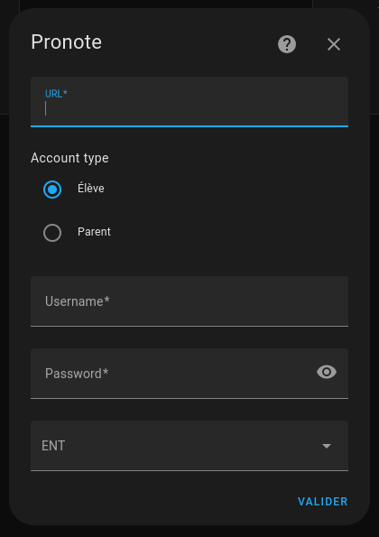

# Pronote integration for Home Assistant

## Installation

### Using HACS

OR

If you can't find the integration, add this repository to HACS, then:  
HACS > Integrations > **Pronote**

### Manual install

Copy the `pronote` folder from latest release to the `custom_components` folder in your `config` folder.

## Configuration with Username Password

Click on the following button:  
  

Or go to :  
Settings > Devices & Sevices > Integrations > Add Integration, and search for "Pronote"

Then follow the step of the config flow:  

Note: if you're using a Parent account, you'll be prompt to select a child:  

## Configuration with QR Code

Click on the following button:  
  

Or go to :  
Settings > Devices & Sevices > Integrations > Add Integration, and search for "Pronote"

Create the QR Code from your pronote account

Scan it to get the json representation, e.g. with google lens (app on phone).
example, copy the text and send by email, note that the code is valid for max 10 mins.

The json looks like:
{"jeton":"AC671F...very long code ... 758B6F","login":"9B91...shorter code...AC0D","url":"https://[id of your school].index-education.net/pronote/mobile.eleve.html"}

Add a pronote entry

Use json, the pin with which you create the code and a random identifier

## Usage

This integration provides several sensors (where `LASTNAME` and `FIRSTNAME` are replaced):
* `sensor.pronote_LASTNAME_FIRSTNAME`: basic informations about your child
* `sensor.pronote_LASTNAME_FIRSTNAME_timetable_today`: today's timetable
* `sensor.pronote_LASTNAME_FIRSTNAME_timetable_tomorrow`: tomorrow's timetable
* `sensor.pronote_LASTNAME_FIRSTNAME_timetable_next_day`: next school day timetable
* `sensor.pronote_LASTNAME_FIRSTNAME_timetable_period`: next school day timetable for next 15 days
* `sensor.pronote_LASTNAME_FIRSTNAME_timetable_ical_url`: iCal URL for the timetable
* `sensor.pronote_LASTNAME_FIRSTNAME_grades`: a list of the latest grades
* `sensor.pronote_LASTNAME_FIRSTNAME_homework`: a list of your child's homework
* `sensor.pronote_LASTNAME_FIRSTNAME_homework_period`: a list of your child's homework for max 15 days
* `sensor.pronote_LASTNAME_FIRSTNAME_absences`: a list of your child's absences
* `sensor.pronote_LASTNAME_FIRSTNAME_evaluations` a list of your child's evaluations
* `sensor.pronote_LASTNAME_FIRSTNAME_averages` a list of your child's averages
* `sensor.pronote_LASTNAME_FIRSTNAME_punishments` a list of your child's punishments
* `sensor.pronote_LASTNAME_FIRSTNAME_delays` a list of your child's delays
* `sensor.pronote_LASTNAME_FIRSTNAME_information_and_surveys` a list of your child's information_and_surveys
* `sensor.pronote_LASTNAME_FIRSTNAME_menus` a list of your child's menus

The sensors above are updated every 15 minutes.
