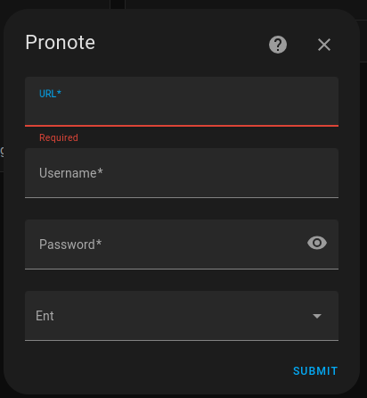
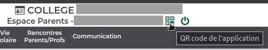
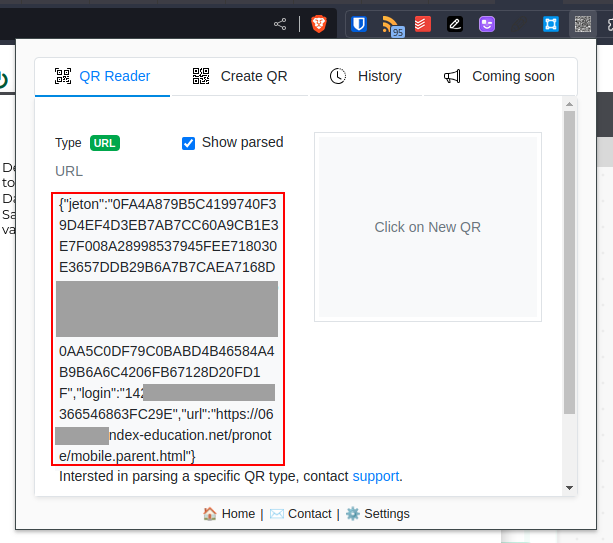
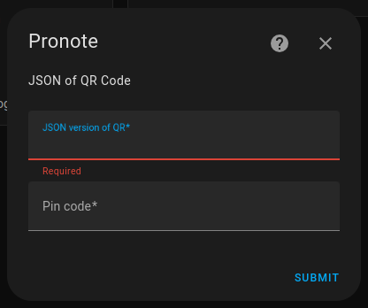
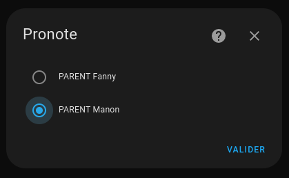

# Pronote integration for Home Assistant

## Installation

### Using HACS

[](https://my.home-assistant.io/redirect/hacs_repository/?owner=delphiki&repository=hass-pronote&category=integration)

OR

If you can't find the integration, add this repository to HACS, then:  
HACS > Integrations > **Pronote**

### Manual install

Copy the `pronote` folder from latest release to the `custom_components` folder in your `config` folder.

## Configuration

Click on the following button:  
[](https://my.home-assistant.io/redirect/brand/?brand=pronote)  

Or go to :  
Settings > Devices & Sevices > Integrations > Add Integration, and search for "Pronote"

You can choose between two options when adding a config entry.  

### Option 1: using username and password

Use your Pronote URL with username, password and ENT (optional):  


### Option 2: using the QR Code

Install the following Chrome Extension: [QR Code Reader](https://chrome.google.com/webstore/detail/qr-code-reader/likadllkkidlligfcdhfnnbkjigdkmci) (only needed for setup).  

Create the QR Code from your Pronote account:  


Use the extension to scan the QR Code:  


And copy the JSON ouput that looks like:
```json
{"jeton":"XXXXXXXXXXX[...]XXXXXXXXXXXXXX","login":"YYYYYYYYYYYYYY","url":"https://[id of your school].index-education.net/pronote/..."}
```

Paste it, and enter the PIN code used for the generation:  


### Parent account

If using a Parent account, you'll have to select the child you want to add:  


## Usage

This integration provides several sensors, always prefixed with `pronote_LASTNAME_FIRSTNAME` (where `LASTNAME` and `FIRSTNAME` are replaced), for example `sensor.pronote_LASTNAME_FIRSTNAME_timetable_today`.


| Sensor | Description |
|--------|-------------|
| `sensor.pronote_LASTNAME_FIRSTNAME` | basic informations about your child |
| `[...]_timetable_today` | today's timetable |
| `[...]_timetable_tomorrow` | tomorrow's timetable |
| `[...]_timetable_next_day` | next school day timetable |
| `[...]_timetable_period` | timetable for next 15 days |
| `[...]_timetable_ical_url` | iCal URL for the timetable (if available) |
| `[...]_grades` | latest grades |
| `[...]_homework` | homework |
| `[...]_homework_period` | homework for max 15 days |
| `[...]_absences` | absences |
| `[...]_evaluations` | evaluations |
| `[...]_averages` | averages |
| `[...]_punishments` | punishments |
| `[...]_delays` | delays |
| `[...]_information_and_surveys` | information_and_surveys |
| `[...]_menus` | menus (if available) |

The sensors are updated every 15 minutes.

## Cards

Cards are available here: https://github.com/delphiki/lovelace-pronote
