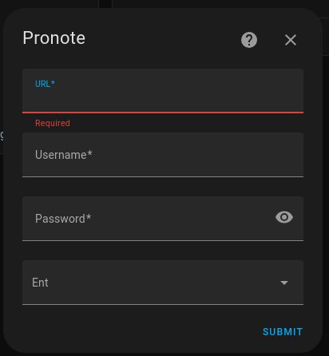
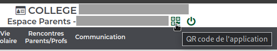
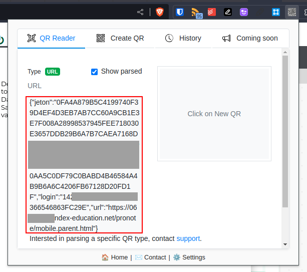
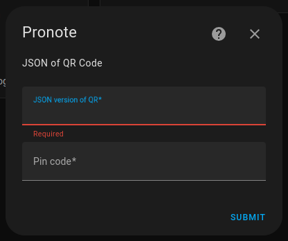
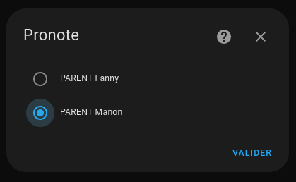

# Pronote integration for Home Assistant

## Installation

### Using HACS

[](https://my.home-assistant.io/redirect/hacs_repository/?owner=delphiki&repository=hass-pronote&category=integration)

OR

If you can't find the integration, add this repository to HACS, then:  
HACS > Integrations > **Pronote**

### Manual install

Copy the `pronote` folder from latest release to the `custom_components` folder in your `config` folder.

## Configuration

Click on the following button:  
[](https://my.home-assistant.io/redirect/brand/?brand=pronote)  

Or go to :  
Settings > Devices & Sevices > Integrations > Add Integration, and search for "Pronote"

You can choose between two options when adding a config entry.  

### Option 1: using username and password

Use your Pronote URL with username, password and ENT (optional):  


### Option 2: using the QR Code

Install the following Chrome Extension: [QR Code Reader](https://chrome.google.com/webstore/detail/qr-code-reader/likadllkkidlligfcdhfnnbkjigdkmci) (only needed for setup).  

Create the QR Code from your Pronote account:  


Use the extension to scan the QR Code:  


And copy the JSON ouput that looks like:
```json
{"jeton":"XXXXXXXXXXX[...]XXXXXXXXXXXXXX","login":"YYYYYYYYYYYYYY","url":"https://[id of your school].index-education.net/pronote/..."}
```

Paste it, and enter the PIN code used for the generation:  


### Parent account

If using a Parent account, you'll have to select the child you want to add:  


## Usage

This integration provides several sensors, always prefixed with `pronote_LASTNAME_FIRSTNAME` (where `LASTNAME` and `FIRSTNAME` are replaced), for example `sensor.pronote_LASTNAME_FIRSTNAME_today_s_timetable`.


| Sensor                                    | Description                                          |
|-------------------------------------------|------------------------------------------------------|
| `sensor.pronote_LASTNAME_FIRSTNAME_class` | basic informations about your child's class          |
| `[...]_today_s_timetable`                 | today's timetable                                    |
| `[...]_tomorrow_s_timetable`              | tomorrow's timetable                                 |
| `[...]_next_day_s_timetable`              | next school day timetable                            |
| `[...]_period_s_timetable`                | timetable for next 15 days                           |
| `[...]_timetable_ical_url`                | iCal URL for the timetable (if available)            |
| `[...]_next_alarm`                        | next alarm timestamp based on timetable              |
| `[...]_grades`                            | latest grades (current period)                       |
| `[...]_homework`                          | homework                                             |
| `[...]_period_s_homework`                 | homework for max 15 days                             |
| `[...]_absences`                          | absences (current period)                            |
| `[...]_evaluations`                       | evaluations (current period)                         |
| `[...]_averages`                          | averages (current period)                            |
| `[...]_punishments`                       | punishments (current period)                         |
| `[...]_delays`                            | delays (current period)                              |
| `[...]_overall_average`                   | overall average (current period)                     |
| `[...]_information_and_surveys`           | information and surveys                              |
| `[...]_discussions`                       | discussions (messaging), with unread count           |
| `[...]_menus`                             | menus (if available)                                 |
| `[...]_current_period`                    | current period name and dates                        |
| `[...]_periods`                           | list of all periods                                  |
| `[...]_previous_periods`                  | list of previous periods                             |
| `[...]_active_periods`                    | list of active periods (previous + current)          |

For each previous period (e.g. `trimestre_1`), the following sensors are also created:

| Sensor                                    | Description                                          |
|-------------------------------------------|------------------------------------------------------|
| `[...]_grades_trimestre_1`                | grades for the period                                |
| `[...]_averages_trimestre_1`              | averages for the period                              |
| `[...]_absences_trimestre_1`              | absences for the period                              |
| `[...]_delays_trimestre_1`                | delays for the period                                |
| `[...]_evaluations_trimestre_1`           | evaluations for the period                           |
| `[...]_punishments_trimestre_1`           | punishments for the period                           |
| `[...]_overall_average_trimestre_1`       | overall average for the period                       |

The sensors are updated every 15 minutes.

### Discussions

The `discussions` sensor exposes the PRONOTE messaging tab ("Communication").
Its state is the number of discussions, excluding trashed ones and drafts.

The messaging tab belongs to the **account**, not to a child: on a parent
account with several children, every entry reports the very same discussions.
The `discussions` option (Settings > Devices & services > Pronote > Configure)
lets them be exposed by a single entry; disabling it removes the sensor and the
switches of that entry, and skips the requests altogether.

| Attribute      | Description                                                        |
|----------------|--------------------------------------------------------------------|
| `unread_count` | total number of unread messages, across every discussion            |
| `discussions`  | the most recent discussions, newest first                           |

Each entry of `discussions` holds `subject`, `creator`, `unread`, `closed`,
`labels`, `messages_count`, `date` (first message), `last_message_date`,
`last_message_author`, `last_message`, and `messages` (the last 3, each capped
at 1000 characters). `author` is `null` when you are the author of the message.

Reading the messages of a discussion costs one request per discussion, so they
are only loaded for the 10 most recent ones; older discussions keep their
metadata without content.

Home Assistant stops recording entity attributes past 16 KiB, and discussions
pile up over a school year. Rather than exposing a fixed number of them, the
most recent ones are kept until that budget is reached: a handful of
discussions keep their full content, while a busy mailbox degrades gracefully.
The state and `unread_count` always cover every discussion.

A `pronote_event` of type `new_discussion` is fired when a discussion is created
or receives a new message, which can be used to trigger a notification.

Discussions can be marked read (or unread) without opening PRONOTE, with the
`pronote.mark_discussions_as_read` service:

```yaml
service: pronote.mark_discussions_as_read
target:
  entity_id: sensor.pronote_lastname_firstname_discussions
data:
  subject: "Sortie scolaire"   # optional, every discussion when omitted
  read: true                   # optional, defaults to true
```

Marking is a write to PRONOTE, and PRONOTE rotates the session token: the mark
is therefore queued and applied by the coordinator on its own client, during a
refresh triggered immediately by the call. Opening a second session in parallel
would invalidate the one the integration uses. Targeting the whole device is
safe: the service is a no-op on the other sensors.

Each discussion also gets its own switch, named after its subject:

| State | Meaning                                                            |
|-------|--------------------------------------------------------------------|
| on    | the discussion is read; turning it off marks it unread in PRONOTE   |
| off   | the discussion has unread messages; turning it on marks it read     |

Switches are created and removed as discussions come and go, so the entity
registry stays in step with the messaging tab. They are left untouched when a
refresh fails, to avoid deleting entities on a transient error.

## Cards

Cards are available here: https://github.com/delphiki/lovelace-pronote
